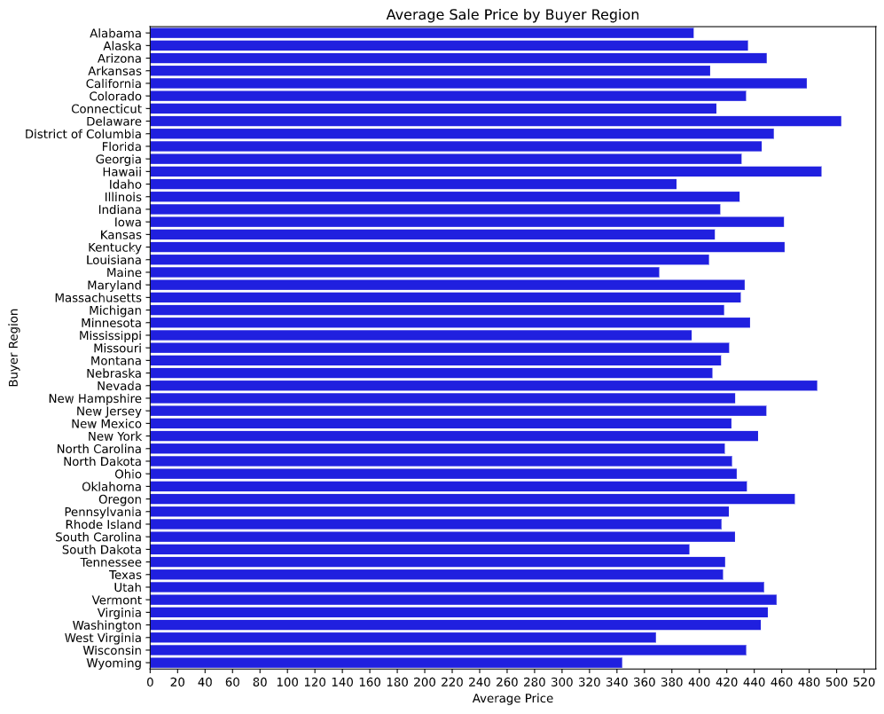
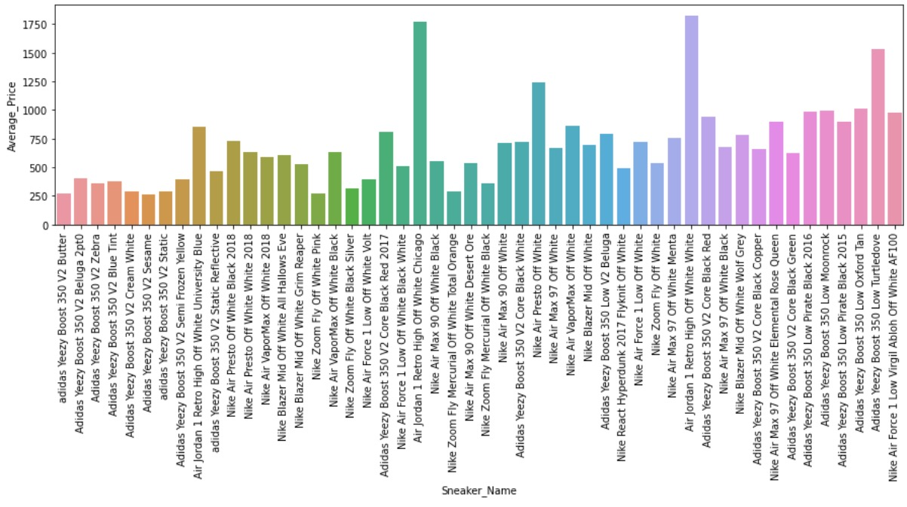
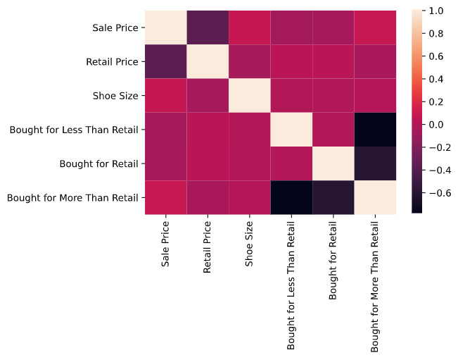
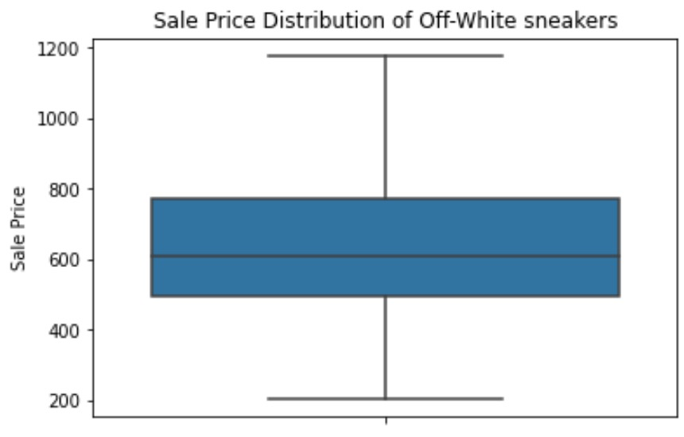
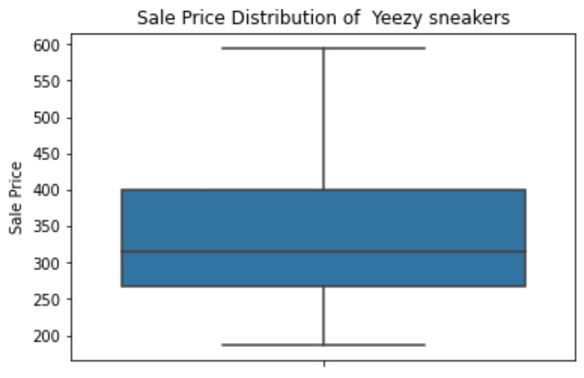
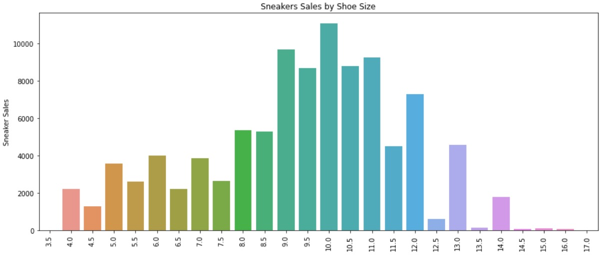
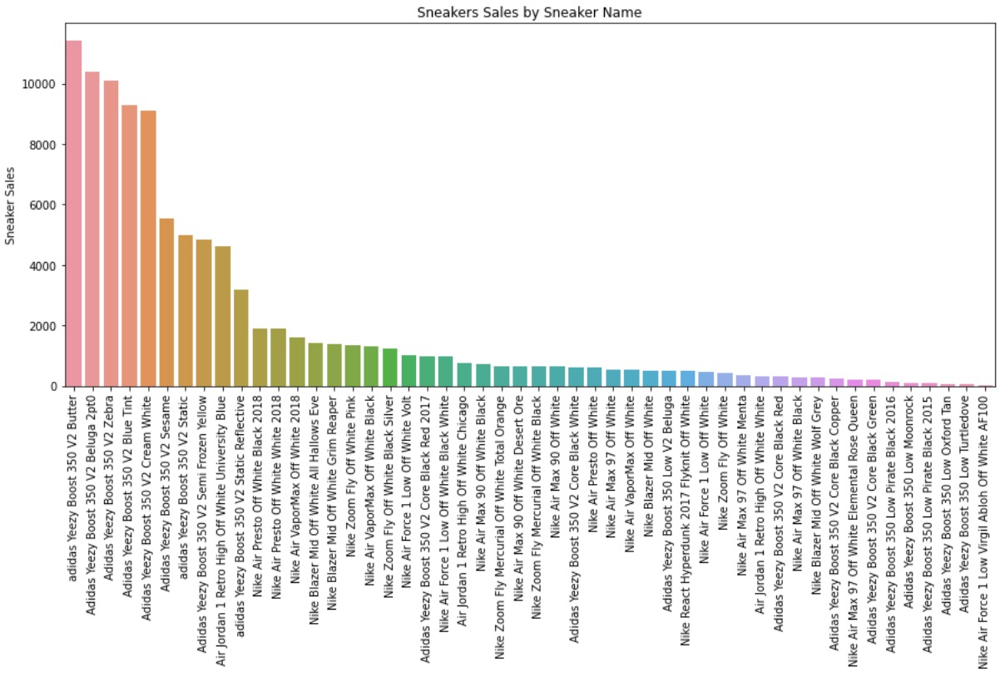
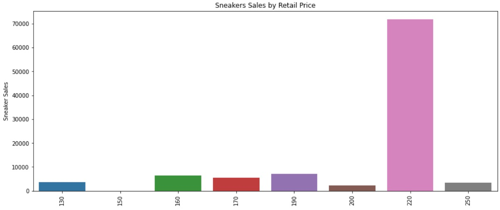

# StockX Sneaker Price Prediction Project

The purpose of this project is to predict the resale price of a sneaker based on several factors like the type of sneaker and buyer region.


[](https://opensource.org/licenses/MIT)

## Demo


## Intro

The Footwear industry consists of companies engaged in the manufacturing of footwear such as dress shoes, slippers, boots, galoshes, sandals and athletic and trade related footwear; however, the most lucrative sector of this industry is collectible sneakers. The rise of marketplace apps like StockX and GOAT, alongside the proliferation of social media sites where you’re just one message away from turning a rare pair of trainers into cash, mean that more people are selling their shoes than ever before. The global sneaker resale market has been valued at over $2 billion, while the right pair of kicks can go for over $10,000 💸. Moreover, the massive margin of profit for each shoe makes the resale market attractive to those who would like to make some extra cash, given that in the past year, the average profit margin in the sneaker industry was 42.5%.

While there is plenty of money to be made, it can be risky to buy a shoe due to the volatile nature of each shoe. Sneakers are like stocks with their resale price constantly changing from day to day. Thus, I developed this web application to predict the price of a given shoe based on factors such as date, shoe size, buyer region, and more. 

This tool resolves the issue of knowing which sneaker is worthwhile and when to buy it.

## Table of Contents
- [Title](#stockx-sneaker-price-prediction-project)
- [Demo](#demo)
- [Intro](#intro)
- [Table of contents](#table-of-contents)
- [Installation](#installation)
- [Usage](#usage)
- [Development](#development)
- [Productionization](#productionization)
- [Reflection](#reflection)
- [License](#license)
- [Contact](#contact)

## Getting Started

### Installation

Clone this repo, create a blank Anaconda environment, and install the requirements file.
```bash
# Creates new environment called 'stockx-env'
conda create -n stockx-env python=3.8
# Activates the environment we just made
conda activate stockx-env
# Install the requirements
pip install -r requirements.txt
```

### Usage

Make sure to run the app from the `application/` directory.
```bash
cd application
python app.py
```
### Understanding the Data

The data I used is from [StockX's data competition in 2019](https://stockx.com/news/the-2019-data-contest/). Here's a description of the data from StockX:

"The data we’re giving you consists of a random sample of all Off-White x Nike and Yeezy 350 sales from between 9/1/2017 (the month that Off-White first debuted “The Ten” collection) and the present. There are 99,956 total sales in the data set; 27,794 Off-White sales, and 72,162 Yeezy sales. The sample consists of U.S. sales only.

To create this sample, we took a random, fixed percentage of StockX sales (X%) for each colorway, on each day, since September 2017. So, for each day the Off-White Jordan 1 was on the market, we randomly selected X% of its sale from each day. (It’s not important to know what X is; all that matters is that it’s a random sample, and that the same fixed X% of sales was selected from every day, for every sneaker). Every row in the spreadsheet represents an individual StockX sale. There are no averages or order counts; this is just a random sample of daily sales data."

I did some exploratory data analysis and made some visuals:

*Fig. 1: The Average Daily Sale Price from 2017 to 2019*


*Fig. 2: The Average Sale Price per Buyer Region*


*Fig. 3: The Average Sale Price by Sneaker Name*


*Fig. 4: Coorleations between each feature*


*Fig. 5: Sale Price Distribution of Off-White Sneakers*


*Fig. 6: Sale Distribution of Yeezy Sneakers*


*Fig. 7: The Most Popular Shoe Sizes*


*Fig. 8: The Most Popular Sneakers*


*Fig. 9: Best Selling Sneaker Retail Prices*


## Development

### Data Cleaning

The data that StockX gave me was not very messy. Here's what I did:

* Changed 'order date' dtype
* Changed 'release date' dtype
* Removed '-' from sneaker name
* Removed '$' and comma from sale price
* Removed '$' from retail price
* Renamed columns to get rid of spaces 
* Converted dates into numericals
* Converted categorical data to numerical using OneHotEncoding


### Model Building 

To begin, I split the data into train and tests sets with a 80/20 split. 

I selected three models:
* Random Forest Regressor because has the power to handle a large data set with higher dimensionality, provides higher accuracy through cross validation, is commonly used when analyzing the stock market due to its random nature, and each tree draws a random sample from the original data set when generating its splits, adding a further element of randomness that prevents overfitting.

* XGBoost because I have a large number of training examples given that this dataset is has about 100,000 rows. Therefore, it should have plenty of data to learn from and apply gradient boosting. This dataset also has a mix of categorical and numerical features, which XGBoost tends to do well with.

* Decision Tree Regressor as a baseline model to compare the others to.


### Model performance
Since I am trying to predict an exact value, I decided to use mean squared error to measure the accuracy of each model. I was expecting XGBoost to perform the best due to its gradient boosting methods, however, the random forest regressors was able to outpereform it. 

```
Decision Tree Accuracy (Baseline): 0.97284
XGBoost Test Accuracy: 0.98225
RandomForest Test Accuracy: 0.98452
Model with best accuracy: RandomForest
```

## Productionization 

In this step, I pickled my model and saved it into a callable object to be used to create a basic Flask application.

After that, I struggled to summon my knowledge of HTML and CSS from my 6th grade tech class to create a simple front-end web site for my model to be hosted. I inserted my model into the web application and the rest is history! (Check out the [Demo](#demo))

## Reflection

### Real World Application

This project can be applied in several ways.

1. Helping to decide when to buy a sneaker by predicting its price at any given time 📈
2. Knowing which factors influence the sale price of each sneaker can help businesses optimize their shoe buying process to those that have the most potential 👍
3. Sneaker businesses can see a timeline of when sneaker prices are high or low to know when to buy/sell 📆
4. Know if your friend got ripped off for buying their shoes too early or too late! 🤣

### What I learned
All in all, this project gave me better insight into the worlds of machine learning and sneakers. 

If I was to do this project again, I would choose a different way to handle categorical variables other than OneHotEncoding such as ` pd.get_dummies` to reuce the amount of features. When I was creating the Flask application, it was difficult to recreate the lucrative amount of features that I had from my training data in a real world appliction, and using a different method would absolve this issue.

I was surprised that Off-White sneakers typically sold for much more than Yeezy sneakers. From my experience as a sneaker reseller, this threw me off guard. Moreover, I was surprised to see that certain retail prices typically sold better than others. Visualizing the data helped me notice these trends and I now know how I can apply them.

## License
MIT License

Copyright (c) 2020 Logan Norman

Permission is hereby granted, free of charge, to any person obtaining a copy
of this software and associated documentation files (the "Software"), to deal
in the Software without restriction, including without limitation the rights
to use, copy, modify, merge, publish, distribute, sublicense, and/or sell
copies of the Software, and to permit persons to whom the Software is
furnished to do so, subject to the following conditions:

The above copyright notice and this permission notice shall be included in all
copies or substantial portions of the Software.

THE SOFTWARE IS PROVIDED "AS IS", WITHOUT WARRANTY OF ANY KIND, EXPRESS OR
IMPLIED, INCLUDING BUT NOT LIMITED TO THE WARRANTIES OF MERCHANTABILITY,
FITNESS FOR A PARTICULAR PURPOSE AND NONINFRINGEMENT. IN NO EVENT SHALL THE
AUTHORS OR COPYRIGHT HOLDERS BE LIABLE FOR ANY CLAIM, DAMAGES OR OTHER
LIABILITY, WHETHER IN AN ACTION OF CONTRACT, TORT OR OTHERWISE, ARISING FROM,
OUT OF OR IN CONNECTION WITH THE SOFTWARE OR THE USE OR OTHER DEALINGS IN THE
SOFTWARE.
## Contact
Feel free to reach out to me on LinkedIn and follow my work on Github! 

<br>
<p align="center">
<a href="https://www.linkedin.com/in/logannorman/">

</a>

<a href="https://github.com/lognorman20">

</a>
</p>
